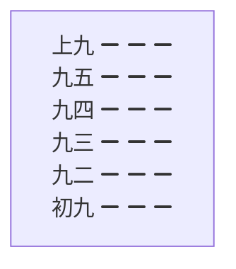

# 乾卦

周易一 卦天, 乾卦

[TOC]

## 一、卦名

  乾 天行健大哉乾元万物资始。

## 二、卦画



## 三、卦象

乾卦的象征, 在自然中象征`[?]`<!--天没缘天生万物-->如君王管理万民, 如父亲管理家庭一样, 作为一个长辈, 要有天一样的性情, 做事有理有节, 具有长者风范; 作为一个领导要有天一样的章法, 赏罚分明公正. 若天象紊乱则季节反常, 四时不宁则万物受损. 首当其冲就是数量减少或灭绝天下生灵涂炭<!--进遭殃-->, 所以作为一个领导人要正义<!--杳冥里-->, 要赏罚分明, 才会使所管辖的百姓安居乐业. 如若长者[为天里乱发髻](?), [为老不尊](?) <!--咋老不尊人-->, 痛恨摔倒, 无人扶老人是后人的表率.  
乾为男主人, [一旦某日天降灾祸, 受损的将会是整个家族, 用钱来比喻, 可想会是怎样的.](一旦一日天降摘受损的会使整个家族用钱来比喻可想会是怎样的呢？)  
乾为强兼顾, 所以[象金玉钱财象冰, 杨盛奇则涉及红](?), 故为大红大赤色, 刚健有力的, 权威的, 积极向上的, 园形的, 男性长辈, 珍贵的, 富有的, 寒冷的, 坚硬的, 易碎的, 在上的, 等等... 都归于乾卦, 因此乾具有比拟如下事物: ???

## 四、象意

`圆满` `老成` `迈进` `功勋` `气通`  
`成功` `正直` `久德` `专利` `扩大`  
`发光` `工作` `理想` `决策` `事业`  
`活动` `自强不息` `高大` `重大` `阳光`  
`仁德` `善良` `敬生` `积极` `盛大`  
`强大` `富有` `珍贵` `美好` `吉利`  
`祥庆` `福禄` `先始` `元贞` `盈神`  
`高级` `美观` `经济` `资金` `事业`  
`贵气` `天赋` [天堂天一天至千里天生天价](?)  
`经力旺盛` `健康健全` `身材好业务` `激烈` `决断`  
`果断` `任性` `专横` `独霸` `压抑`  
`强制` `制裁` `侵略` `过分` `冷酷`  
`轻视` `愤怒` `惩罚` `威严` [统帅统遮政硬赏识主宰](?)  
`灾害` `死丧` `刚多易折` `车祸` `僵尸`  
`杀气` `寒气` `天灾` `罚款`
**用上面的象意任意造句这就是算卦**

## 五、形态

`完美无缺` `圆形的` `高档的` `精致的` `坚硬的`  
`实心的` `趾高气扬` `金黄色` `创造` `积极`  
`明亮` `好看` `高大` `易碎` `在上的`  
`天生的`

## 六、天象

晴天 太阳 大自然 冰雹 雪 寒冷
天时 秋天 九十月之友 戌亥年月日时
有利时间: 庚辛申酉戌亥辰丑未年月日时, 进财
不利时间: 丙丁巳午壬奎亥子年月日时, 有灾破财

## 七、地理

京城都市, 大城市, 博物馆, 寺院庙宇
名胜古迹政府机构大会堂广场学校.高楼大厦商店五金商场金属加工厂刚材市场铁匠车站执法部门公安派出所法院检察院银行经济部门营业厅矿山弯曲的大道郊野远处金店银行

## 八、方位

有利方位: 西北 西 西南 东北 -> 进财, 顺利
不利方位: 南方 北方 -> 不顺 破财 车灾

## 九、人物

代表上层人物 有领导地位的人 起决定作用的人 有权的人 当官的  
有钱的人 富人 社会名人 神 圣人 君王 君子 祖父 父亲 家长  
军警 执法的人 经济工作者 管钱的人 书记 一把手 厂长 董事长  
经理 村长 专家 公务员 司机 男人 丈夫 老人  
过于自谦者为 乞丐 下人 单身 光棍 和尚
过于专横不讲理者、恶人 黑社会老大 犯罪的人

## 十、人体

头首 胸部 肺 左足 左下腹 精液 男性生殖器 身体强壮 年体寒骨瘦之人

## 十一、疾病

大脑头面之疾、筋骨之疾 肺疾 骨疾 寒症 硬化性疾病 老毛病变化  
异常之病 结肠病 便闭壅结性病 阳萎 右腿疾病 寒精 死精 结石  
伤寒 发热 思想病

## 十二、乾卦掌管着戍乾亥三山

戌中藏有戌戊土辛金丁火  
戊土在9月把力量因生庚金辛金申酉后消耗的差不多了, 土性不是很强了  
辛金在9月把多餘的力量收藏起來將孕育子女一水因此9月就是金库  
辛金死于12月丑土墓库  
丁火被土泄金耗在9月結束了一生。火死于9月入墓库。
乾山卦气五行属金, 象征已经成熟正在孕育子女一亥水壬水长生于7月孕育时期,  
9月是成年人, 以亥水同居乾宮, 正受父母養育着壬水亥水, 五行论不是很强。
亥山中有壬水甲木, 甲木生长以10月, 10月亥水就是甲木的孕育期。

## 十三、数目

先天数为1, 后天数为6, 河图数为4, 9, 0, 10

## 十四、色彩

大赤色（大红色）金黄色, 有（六白, 七赤佱星）

## 十五、姓氏-属相

- 姓氏带金字旁
- 属相狗, 猪。

## 十六, 动物

龙, 马, 狮子, 象, 天鹅。

## 十七, 食物

马肉肝肺金贞蛋新的食物水果丸子馒头荷包馄饨交子米饭。

## 十八, 物象

金玉珠宝玛瑙宝石金钱银园硬币钟钟表镜子眼镜古董文物首饰, 神物电脑, 高级车辆, 火车, 飞机, 小桥车, 机器, 刚材, 实心, 金属用品, 水果, 瓜果豆, 帽子。地球仪钢球水晶球紫金洞, 玉鼎, 玉如意, 握手, 金蟾, 钢笔, 玻离, 电杆, 电信, 塔架, 冰箱, 保险柜, 钢铜铝铁。
金钱树, 发财树, 银杳树, 金子兰,
乾卦在右下角力, 为权力, 为金钱, 为地位, 事业, 工作。

## 十九, 性格

你是个坚强硬朗的人, 事业心强, 工作有能力, 有经济头脑, 理想远大, 精力过人, 做事果断, 性格较强, 坚守中正之道, 注重诚信为人, 忠厚正直, 忠义气, 太实在, 实话实说, 说一不二, 始终如一, 光明磊落, 尽善尽美, 人缘关系好, 很有威望, 赢得社会及众人的信任。
在人生的道路上, 勤学苦练, 自强不息, 追求圆满, 思想境界高, 头脑清醒, 能审时度势, 考虑问题精密周到, 敏锐, 积极迈进。有领导才能统率一切是一个有骨气汉子, （如果是女人占着就象一个男人的性格但缺乏感情温度, 人很帅气, 身体强壮, 知理豁达,  有正义感。）
                  11页

## 二十, 象征

乾象征天用龙来比喻, 指有徳才的君子。又象征纯阳和健, 表明兴旺强健乾卦是根据万物变通的道理, 喻示吉祥如意, 教导人们顺天道而行, 君子应以。自强不息的精神不停地奋斗下去。

## 二十一、卦辞

元亨利贞, 这是乾卦的判斷吉凶的断語。
元：`开始, 创始, 大也, 仁也。`
亨：`畅通。`

## 二十二

簡單的來说就是做任何事情一开始就要以善为本你的事业就能長久应该还有善意谋略无论做什麼事情都要有善良仁愛之心, 這樣不仅可以达到预期的目標而且可以長久下去, 我們所做的一切都是美好的只有将美好的东西汇集在一起才能亨通顺畅把他用在企業管理上, 那就是你的企業的各种要素都是上等的优秀的最好的把這些美好的要素都汇聚集到一起來你的企業就是亨通的, 欣欣向榮的企業, 你的企業要想成为一个优秀的企業就必須从基础抓起, 一环扣一环, 环环扣紧不放过任何一个小节只有各个要素都是优秀的你的企業才能优秀
利, 为收获, 有利顺利, 有所成就, 利就是利益是义的集會, 是把各种义, 仁义的义汇聚在一起那才有利。怎樣才能获得大利呢？那就是要有义, 要做到正当有正义有道义, 要符合道义来做, 你才行, 當然有的人, 開始沒有安照义来做也赚了錢发了財暴富了, 那你一定要注意是很危險的所以小胜靠智, 大胜就要靠德, 义,就是說德的一种因此大家都要靠德来发財这样才能真正发大财。

## 二十三

  乾卦讲述的是大自然运行过程, 由潜藏酝酿生机萌芽生長奋发茁壯欣欣向荣, 经过不断的考验到达开花结果的极盛时期, 然后又由盈而亏返回原始重新开始以龙来比喻潜伏現身警惕驰骋腾飞过失這是人生的必经的六个阶段。

## 二十四

乾卦的卦辞讲的是时位观即时空观, 任何事物都离不开时空, 这个最基本的条件也只有尊循时空条件才能有利于实現心中的意原。

## 二十五

乾卦的精神是天行健君子自強不息, 为人要刚健不停地强盛下去, 然而这种强又并非是争强好斗, 而是发自于内在的意识里的墙是对人生目标对事业执着追求的强, 要按照元亨利贞的要求去做, 要从仁义礼智信这五个方面去为人处事作为男人, 就应该做君子, 天道酬勤自强不息, 不畏险阻迈向成功, 成功后懂得退让低调谦虚就能长久挺立巅峰。

## 占卜

1. 占得此卦者是大吉大利的占卜兆示大通而有大利, 但必須行正道方可永远亨通。

    ```cmd
    困龙得水好运交, 不由喜气上眉梢。
    一切謀求皆如意, 向后时运渐渐高。
    ```

2. 运气, 万事順利吉祥如意旺盛名利双收地位擢升与家业繁荣之吉象, 此卦尚有功名荣达名门富跺强大富有兴盛, 有领导与友人的帮助发扬光大幸福亨通园满成功老來成功的多, 有天赐的福, 易多做善举, 才能長久亨通。
3. 妇女占到此卦表示唯我独尊的驕傲象, 大男子汉主义, 婚姻一定不建康, 內心具有一种不可动摇不可阻擋的生命力量, 体现出一种顽强不屈的意志, 重大的进步往往都是重大灾难之后出現的, 我們要持自强厚德的君子精神一定能克服困難从胜利走向胜利。经过艰苦的岁月, 历尽艰险是在急风暴雨式的人生環境中成长起來的, 难免槽受挫折有悲傷天灾欠安多易发生在4月10月车祸之险。11岁克父。
4. 财运, 施比受有福, 不利买而利卖。
5. 事业, 大吉大利万事如意心, 想事成, 自有天佑, 春风得意, 十分順利有发展向上的大好机会, 事业如曰中天阳气已經到了顶点盛极必哀, 务須提高警覺小心謹慎力戒骄傲, 冷靜处世心境平和心正光明磊落不玩花招順其自然, 以善为本不计较眼前的得失, 不违背社會公德不违反他人利益不为外物所动, 关建要选择好下手处, 注重問题的空間它的彈性, 坚守信用警惕邪念控制杂念心存誠实, 先施以于善行, 善德施于社會, 自然得利众人。知进知退居安思危, 不能盲目发展超过自己的极限, 充分發揮自己的才智, 坚持下去才会吉祥, 保证事业順畅。
6. 求名, 潜在能力尚未充分發揮, 只要进一步努力克服骄傲自满情緒进行修德, 以渊博的知识和高尚的品质成君子之名。
7. 家宅, 积善之家必有余庆, 子女过刚宜慎重。
8. 商业, 十分順利有发展向上的大好机会, 但切勿操之过急, 宜冷靜分析形勢把握时机堅持商业道德冷静对侍中途出现的困難定會有满意的結果。
9. 婚姻, 论说婚姻应该是园满的结果, 但是女性往往是理想过高又很要强唯我独尊脾气太强而男人也不弱二人在一起常闹别扭分开几天又柤互店念双方观点不同有缘分㳀婚姻溥弱易婚变, 不能早婚晚婚要好一点。
10. 决策, 可成就大事业, 坚持刚建正直公允的实质修养德行多做善事, 积累知识坚守信念, 自强不息, 必能克服困难, 消除灾难, 获得成功与利益。

## 变卦

### 占得乾卦变姤。第一爻动

乾卦的六条爻辞, 总的来说是讲时位, 讲周而复始的运动即从阶段性来说, 处于不同的位置就应当采取与之相应的行为, 和对策, 既不能越位又不能滞后, 你是濽龙就得勿用, 你是飞龙就得作为, 你是亢龙就得退下来。
 六爻都是占卜用的, 我们就要结合占卜的三个程序,

1. 第一占卜的过程, 第二占卜的结果, 第三就是选择, 这样一种程序, 同时又分第一游戏规则, 第二非常手段, 既然是过程那在过程中又有手叚而且是非常手段。
2. 初九爻辞, 潜藏的㔫无法施展。
3. 易学规则, 初为本卦中开始的一爻, 初九阳爻得位但必境在最下层多少有一些不利的因素, 得正是你的有利条件自然环境是可以的, 基础是挻好的有一种过激的行为又是敌应得不到上面的援助, 纵然有在高的才华位置底下, 即使不服气也要学会隐忍现在发挥不了作用,
4. 目前是事物发展的初步阶段, 虽然有发展的趋势但是比较弱小所以应该小心谨慎不可轻动
5. 占得此爻者, 时运平平说明目前这事情不会有大的成功, 在事业或其他方面正处于初级阶段应当求稳不求快, 要低调做人, 宜沉稳待机, 若是一动作即生灾谋事不利。
6. 春天的时运一般, 做事有阻力, 事业上有亏损或失败, 虽然辛苦但利求财能成功。
秋天的时运好, 有志同道合的朋友帮忙心想事成有好事办事顺利能够成功。
其它月份平平安安如往常, 普通过日子。
鸿运中衰, 适宜谋事还会有喜事, 更应注意挑色纠纷, 夫妻以诚相待方可转危为安, 预示着求学评职称谋事等都会给你带来升迁的机会。
7. 宜往西方西南方向发展是吉利的。
8. 乾为体 你是个坚强硬朗的人, 这野心强, 工作有能力, 有经济头脑, 理想远大, 精力过人, 做事果断, 性格较强, 坚守中正之道, 注重诚信为人, 忠厚正直, 忠义气, 太实在, 实话实说, 说一不二, 始终如一, 光明磊落, 尽善尽美, 人缘关系好, 很有威望, 赢得社会及众人的信任。
在人生的道路上, 勤学苦练, 自强不息, 追求圆满, 思想境界高, 头脑清醒, 能审时度势, 考虑问题精密周到, 敏锐, 积极迈进。有领导才能统率, 一切是一个有骨气汉子, 但缺乏感情温度, 人很帅气, 身体强壮, 知理豁达,  有正义感。
9. 时运：平平, 运气, 万事顺利, 吉祥如意, 旺盛名利双收地位擢升, 与家业繁荣之吉象。此卦尚有功名荣达, 名门富跺, 强大, 富有兴盛, 有领导友人的帮助, 发扬光大, 幸福美满, 享通圆满成功, 老来成功的多, 有天赐的福。
妇人占到此卦表示唯我独尊的骄傲象。
经过艰苦的岁月, 历尽艰险, 是在疾风骤雨式的人生环境中成长起来的, 难免遭受挫折, 有悲伤, 天灾欠安, 多易发生在4～10月车祸之险。
10. 财运, 宜守不宜攻。
11. 家宅, 娶妻小心, 西北上有庙, 政府机构, 有树。
12. 婚姻, 应该说是圆满的结果, 但是女性往往理想过高, 又很要强, 唯我独尊, 夫妻二人在一起常闹意见, 分开又相互店念, 缘分浅薄, 婚姻溥弱。有婚变。
13. 疾病, 筋骨疼痛, 肺疾, 结肠病, 阳萎, 右腿痛寒精, 死精。伤寒。
14. 占得此爻, 就是做任何事情, 一开始就要以善为本, 你的事业能长久, 应该还有善于谋略。也就是说, 无论做什么事情 都要有善良的, 仁爱的, 注重道德, 优理德性, 并在初始阶段就要有长远的计划, 长远的目标, 这样不仅可以达到预期的目标, 而且可以长远下去。
企业想要成为一个优秀的企业, 就必须从基础抓起, 一环扣一环, 只有各个要素都是优秀的, 你的企业才能优秀。
怎样才能获得最大的利益？那就要做到正当, 有正义, 有道义, 要符合道义来做, 你才行, 所以说小胜靠智, 大胜就要靠德, 义就是德的一种, 因此, 大家都要靠德求财, 我们做人就要以义为重, 不要再利上斤斤计较, 不要因财失义, 更不要忘恩负义。
不论做什么事？首先要心正, 都要顺应天道, 坚守中正之道, 注重诚信, 头脑清醒, 审时度势, 考虑问题精密周到, 都要光明磊落, 不要玩花招, 顺其自然, 不计较眼前的得失, 不违背社会公德, 不违反他人利益, 不为外物所动, 警惕邪念, 控制杂念, 心存诚实动机, 要纯正, 关键是要选择好下手处, 注重实现中的每一个环节, 每一个步骤, 不忽略每一个可能发生的问题, 要考虑到问题的空间, 它的弹性, 先施于善行善德, 施于众人, 利于社会, 然后得利于众人, 公平就能双赢, 知近知退, 才会吉祥。

### 占得乾卦变同人, 第二爻动

本爻的意是, 龙出现在田野上适宜见到大人。
位不当似乎违反了易理的规定, 表示所处的环境不利, 处境不好, 总有点方法上的不当若了一些小麻烦。
这里占中, 中比正要好对你是有利的, 是能用的机会了比喻你挣脱了压抑的处境开始步入了社会生活创建立业必有所作为, 且前在事业方面正处于积极上升的阶段了可以积极进取争取贵人的帮助, 广乏地施展自己的才华, 坚守中庸之道, 日常生活中持守信用, 日
常行为谦虛谨慎警惕邪念, 控制杂念, 心存诚实纯一,
有成绩和贡献时不夸燿以博大的德行赢得社会众人的信任以倡导文明, 是先以善行美德施于众人利益社会, 然后得利于众人。
所求的事物或人均属地神所主宰, 要祭拜土地老爷求照应。

1. 占得此爻者, 表示你已经崭露头角, 才华受到注意了这是见到大人是有利的, 因为这个时候虽然具备了一定的能力, 但是还很有限, 如果有遇到大人物, 可以获得进一步的磨练和栽培, 另外若得到大人的提携, 会更加顺利, 这个大人就是自己的贵人, 得贵人支持, 有发展的机会。如果从人的一生来讲, 这个阶段相当于25一35岁左右表明经过一定时间的学习和积累具备了一定的能力到了一展身手的时候若有贵人的, 相助, 会更有利于成功。
2. 小时候学习还是可以的家庭生活在当时也是说得过去的, 祖上的发展很吃祥, 父亲是一个很有名气的人, 对你是很有帮助的。
3. 前些时侯运气确实不错, 做事有人帮助, 办事顺利。
4. 当年的运气要给合当年的地支來推算。
5. 婚姻, 论说婚姻应该是圆满的结果, 但是女性往往理想过高, 又很要强, 唯我独尊, 二人在一起常闹别扭, 分开又相互店念, 有缘分浅婚婚溥弱, 不注重夫妇之德, 否则发生婚变。
6. 疾病, 筋骨疼痛, 肺疾, 结肠病, 伤寒, 阳萎, 右腿弯曲疼痛, 寒精死精,
7. 环境调理, 在客厅的南方放一瓷羊。
8. 夏天的时运不好, 困難多端, 麻煩事不少, 有损失, 经济上有压力, 还会遇到意外災害办事不顺难成。
  秋天的时远好, 有志同道合的朋友帮助, 工作上面应该是事半功倍的效果, 经济收入好, 办事顺能成功。
  其它月份平平安安如往常, 普通过日子。
9. 性格,
你是个坚强硬朗的人, 这野心强, 工作有能力, 有经济头脑, 理想远大, 精力过人, 做事果断, 性格较强, 坚守中正之道, 注重诚信为人, 忠厚正直, 忠义气, 太实在, 实话实说, 说一不二, 始终如一, 光明磊落, 尽善尽美, 人缘关系好, 很有威望, 赢得社会及众人的信任。
在人生的道路上, 勤学苦练, 自强不息, 追求圆满, 思想境界高, 头脑清醒, 能审时度势, 考虑问题精密周到, 敏锐, 积极迈进。有领导才能统率, 一切是一个有骨气汉子, 但缺乏感情温度, 人很帅气, 身体强壮, 知理豁达,  有正义感。
10. 占得此爻, 就是做任何事情, 一开始就要以善为本, 你的事业能长久, 应该还有善于谋略。也就是说, 无论做什么事情 都要有善良的, 仁爱的, 注重道德, 优理德性, 并在初始阶段就要有长远的计划, 长远的目标, 这样不仅可以达到预期的目标, 而且可以长远下去。
企业想要成为一个优秀的企业, 就必须从基础抓起, 一环扣一环, 只有各个要素都是优秀的, 你的企业才能优秀。
怎样才能获得最大的利益？那就要做到正当, 有正义, 有道义, 要符合道义来做, 你才行, 所以说小胜靠智, 大胜就要靠德, 义就是德的一种, 因此, 大家都要靠德求财, 我们做人就要以义为重, 不要再利上斤斤计较, 不要因财失义, 更不要忘恩负义。
不论做什么事？首先要心正, 都要顺应天道, 坚守中正之道, 注重诚信, 头脑清醒, 审时度势, 考虑问题精密周到, 都要光明磊落, 不要玩花招, 顺其自然, 不计较眼前的得失, 不违背社会公德, 不违反他人利益, 不为外物所动, 警惕邪念, 控制杂念, 心存诚实动机, 要纯正, 关键是要选择好下手处, 注重实现中的每一个环节, 每一个步骤, 不忽略每一个可能发生的问题, 要考虑到问题的空间, 它的弹性, 先施于善行善德, 施于众人, 利于社会, 然后得利于众人, 公平就能双赢, 知近知退, 才会吉祥。

### 占得乾卦变履。第三爻动

有才德的君子始終是白天勤奋努力, 夜晚戒惧反省不敢有丝毫大意, 这样即使遇到危險, 也会逄凶化吉。
  表示处于可以大有作为而又充滿凶险的環境中就要有非常手段1, 言行如一増益品德修养。2, 讲话文雅一點文明一點以诚待人以信立业。3, 预知时机以到即全力以赴把握机会。4, 知道该止則止即适可而止。5, 对以真實的地位不居功傲慢, 处于卑微的地位不自卑不忧愁。6, 终曰勤奋努力不懈怠。7, 检討自己惕厉自己。8, 能做到与时偕行, 你想办的事都能办到。
  无咎只依賴于无咎而不知道去努力創造无咎的局面。

1. 得此爻者, 会往來不停, 财利难获, 凡事不认真计划, 躁动者会有损失, 如果能保持忧虑和謹慎的态度則沒有过失。
  表示小時侯学习还是可以的家庭生活在当时也还說得过去, 祖上的发展也还行, 父亲是对你很有帮助的。
  从人的一生来看, 这是代表的是35-45岁左右的时期, 这个时期人生事业处于不上不下压力最大的时期, 需要坚持不懈, 你在周围的人, 人缘好, 活動能力大朋友多做事有人帮助, 事业的发展比较理想, 与兄弟姊妹相处的比较近乎, 虽然你过于刚强但是所处的环境对你还是有利的, 这个阶叚是矛盾转化的交际之处, 成功了又走向失敗, 是事物发展到了一定阶段, 停止不前, 功业有成但要謹慎防凶。
  你朝着且的地快马加鞭日夜兼程往前赶却在无意间有了一个意外的收获, 使你惊喜不已。

2. 你所追求的是花而不是果, 虛而不实, 应当不会有直接的收效, 你能经常反思自己做事有无过錯吗, 只有这样才能避免灾祸。
3. 时运, 功名未显, 戒惧免咎。
4. 家宅, 居住者吉, 西北上有庙, 有政府部门, 有学校, 缺角。有坑, 下水道, 水管,
5. 婚姻, 论说婚姻应该是园满的结果, 但是女人往往理想过高又很要强唯我独尊, 二人在一起常闹别扭, 分开几天又相互店念, 有缘分浅婚姻溥弱, 难免发生婚变。不得引走双方的注意。
6. 疾病, 筋骨疼痛, 肺病, 伤寒 。 阳萎, 寒精, 死精, 右腿弯曲疼痛。
7. 乾为体谋事可成, 但并不理想。
8. 环境调理, 在客厅的西方挂圆钟表。
9. 秋天的运气好, 有志同道合的朋友帮助你心, 想事成吉祥如意, 有好事之兆, 办事順利, 经济收入好能成,
   其它月份平平安安如往常, 普通过日子。
父亲见喜, 父亲喜愛小女儿, 父亲有损, 有父親不是亲的, 二个父親或是钱上有损失。
10. 乾为体你是个坚强硬朗的人, 这野心强, 工作有能力, 有经济头脑, 理想远大, 精力过人, 做事果断, 性格较强, 坚守中正之道, 注重诚信为人, 忠厚正直, 忠义气, 太实在, 实话实说, 说一不二, 始终如一, 光明磊落, 尽善尽美, 人缘关系好, 很有威望, 赢得社会及众人的信任。
在人生的道路上, 勤学苦练, 自强不息, 追求圆满, 思想境界高, 头脑清醒, 能审时度势, 考虑问题精密周到, 敏锐, 积极迈进。有领导才能统率, 一切是一个有骨气汉子, 但缺乏感情温度, 人很帅气, 身体强壮, 知理豁达,  有正义感。
11. 占得此卦, 就是做任何事情, 一开始就要以善为本, 你的事业能长久, 应该还有善于谋略。也就是说, 无论做什么事情 都要有善良的, 仁爱的, 注重道德, 优理德性, 并在初始阶段就要有长远的计划, 长远的目标, 这样不仅可以达到预期的目标, 而且可以长远下去。
企业想要成为一个优秀的企业, 就必须从基础抓起, 一环扣一环, 只有各个要素都是优秀的, 你的企业才能优秀。
怎样才能获得最大的利益？那就要做到正当, 有正义, 有道义, 要符合道义来做, 你才行, 所以说小胜靠智, 大胜就要靠德, 义就是德的一种, 因此, 大家都要靠德求财, 我们做人就要以义为重, 不要再利上斤斤计较, 不要因财失义, 更不要忘恩负义。
不论做什么事？首先要心正, 都要顺应天道, 坚守中正之道, 注重诚信, 头脑清醒, 审时度势, 考虑问题精密周到, 都要光明磊落, 不要玩花招, 顺其自然, 不计较眼前的得失, 不违背社会公德, 不违反他人利益, 不为外物所动, 警惕邪念, 控制杂念, 心存诚实动机, 要纯正, 关键是要选择好下手处, 注重实现中的每一个环节, 每一个步骤, 不忽略每一个可能发生的问题, 要考虑到问题的空间, 它的弹性, 先施于善行善德, 施于众人, 利于社会, 然后得利于众人, 公平就能双赢, 知近知退, 才会吉祥。

### 占得乾变小畜卦, 第四爻动

处于进可大有作为, 仍然缺乏安定感, 說明到了跃跃欲试的試练阶叚, 但是情況并不十分有利还是需要根据形势审时度势把握有利时机, 知进知退。
  非常手段1, 疑惑并非全是坏事有疑惑就有思考有思考就证明有头脑头脑淸醒就能审时度势当进则进当止则止当跃则跃。2, 进退有居的处世准则, 仼何时候都紧紧依靠大众。
 表面上看是没问題, 要想得到无咎这个结果, 就必須貝备以上条努力創造无咎的局面。
 摆在你面前的有两个不同类似的追求且标, 因此你心上心下不知如何是好, 占据主导地位的是你自己。

1. 占得此爻者, 表示力量有限须等待发展到一定程度才可大有作為, 这是45-55岁期間, 情況有所转变家庭收入有所增加, 事业发展较为顺利, 前景是亮丽的一举成名, 只有选择过程注重過程, 才能真正实现理想的目標。
2. 春天的运气一般, 做事有人阻力有事物, 事业上的亏损或失敗, 虽然辛苦但有收获利求财求婚能成功。
  秋天的时运好, 有志同道合的朋友帮助, 心想事成吉祥如意有好事之兆办事順利能夠成功。
   其它月份平平安安如往常, 普通过日子。
3. 时运, 平平生活艰难等待时机, 一举成名。女命逢之则安乐富貴之人, 可以有所作為沒有灾难。
4. 财运, 物价高涨, 可保无咎。
5. 家宅, 有一时振兴之象, 西北上有大庙, 有政府机
6. 婚姻, 论说婚姻应该是很园满的, 但是女性往往理想过高, 又很要强, 唯我独尊, 二人在一起常闹别扭, 分开几天又相互店念, 有缘分浅婚姻溥弱, 易发生婚变, 应该引起高度重视。
7. 疾病, 筋骨疼痛, 肺病, 伤寒, 结肠炎, 阳萎, 寒精死精, 右腿弯曲疼痛。
8. 环境调理,
9. 乾为体, 你是个坚强硬朗的人, 这野心强, 工作有能力, 有经济头脑, 理想远大, 精力过人, 做事果断, 性格较强, 坚守中正之道, 注重诚信为人, 忠厚正直, 忠义气, 太实在, 实话实说, 说一不二, 始终如一, 光明磊落, 尽善尽美, 人缘关系好, 很有威望, 赢得社会及众人的信任。
在人生的道路上, 勤学苦练, 自强不息, 追求圆满, 思想境界高, 头脑清醒, 能审时度势, 考虑问题精密周到, 敏锐, 积极迈进。有领导才能统率, 一切是一个有骨气汉子, 但缺乏感情温度, 人很帅气, 身体强壮, 知理豁达,  有正义感。
10. 占得此卦, 就是做任何事情, 一开始就要以善为本, 你的事业能长久, 应该还有善于谋略。也就是说, 无论做什么事情 都要有善良的, 仁爱的, 注重道德, 优理德性, 并在初始阶段就要有长远的计划, 长远的目标, 这样不仅可以达到预期的目标, 而且可以长远下去。
企业想要成为一个优秀的企业, 就必须从基础抓起, 一环扣一环, 只有各个要素都是优秀的, 你的企业才能优秀。
怎样才能获得最大的利益？那就要做到正当, 有正义, 有道义, 要符合道义来做, 你才行, 所以说小胜靠智, 大胜就要靠德, 义就是德的一种, 因此, 大家都要靠德求财, 我们做人就要以义为重, 不要再利上斤斤计较, 不要因财失义, 更不要忘恩负义。
不论做什么事？首先要心正, 都要顺应天道, 坚守中正之道, 注重诚信, 头脑清醒, 审时度势, 考虑问题精密周到, 都要光明磊落, 不要玩花招, 顺其自然, 不计较眼前的得失, 不违背社会公德, 不违反他人利益, 不为外物所动, 警惕邪念, 控制杂念, 心存诚实动机, 要纯正, 关键是要选择好下手处, 注重实现中的每一个环节, 每一个步骤, 不忽略每一个可能发生的问题, 要考虑到问题的空间, 它的弹性, 先施于善行善德, 施于众人, 利于社会, 然后得利于众人, 公平就能双赢, 知近知退, 才会吉祥。

### 占得乾变大有卦, 第五爻动

龙飞腾在空中意味着君子大有作为。

1. 得此爻者是吉兆, 以人事比拟是刚健中正的大人物己经据有領导者的地位, 且前在事业方面已經发展到了成功的阶段是大展鴻圖的极盛時期, 該如何处事那就得象太阳一样放出光芒照耀四方, 要用善心善意善待家人善待下属善待所有的人, 以天为本蓬勃向上, 以地为本向下扎根, 办什麼事抢在时间前面, 但沒有违背天的规则, 落在時間的后面, 仍然处在常规中, 其中有一条非常重要的那就是平等, 万事万物都是平等的也就是公平性的原則, 能得到最高位, 替天行道, 一切按自然規律办事, 这就充满了希望, 事业蒸蒸日上, 人生得意运势很好飞黃腾达, 大有造化。
2. 显示外來的助力, 你所营谋的事情, 有一个对头处处时时有意无,思给你制造一个又一个阻力和障碍但他终敌不过你, 败在你手下, 你有个更大的目的去追求救济众人。
3. 财运, 五谷之类的貿易, 物价飞升, 有官方支持。
4. 家宅, 居住者吉。西北上有庙, 有政府部门, 有学校, 有花草树木。
5. 婚姻, 论说婚姻应该是圆满的结果, 但是女性往往理想过高, 又很要强, 二人在一起常闹别扭, 分开几天又相互店念, 有缘分浅, 婚姻溥弱有婚变之兆。
6. 疾病, 头疼, 筋骨疼痛, 肺病, 伤寒, 结肠病, 阳萎, 寒精死精, 右腿弯曲疼痛。
7. 运气, 运气很好如日中天, 阳光普照万物, 万民归順顺天顺时大有所成。
8. 环境调理, 在客厅的南方放一瓷羊。
9. 夏天的时远不好, 困難多端, 麻煩事不少有損失經濟壓力大, 還會遇到意外災害車禍之险, 傷腿導致內心不安辦事不順事難办成。
  秋天的十運好, 有志同道合的朋友幫助你心想事成吉祥如意有好事情, 經濟收入好, 办事比較順利是能夠办成功。有個好父親。
  其他月份平平安安如往常普普通通過日子。
時運, 吉利的預兆直上雲霄。
家宅, 富貴之家, 西北上有大廟政府機构有變壓器。
10. 乾为体, 你是个坚强硬朗的人, 这野心强, 工作有能力, 有经济头脑, 理想远大, 精力过人, 做事果断, 性格较强, 坚守中正之道, 注重诚信为人, 忠厚正直, 忠义气, 太实在, 实话实说, 说一不二, 始终如一, 光明磊落, 尽善尽美, 人缘关系好, 很有威望, 赢得社会及众人的信任。
在人生的道路上, 勤学苦练, 自强不息, 追求圆满, 思想境界高, 头脑清醒, 能审时度势, 考虑问题精密周到, 敏锐, 积极迈进。有领导才能统率, 一切是一个有骨气汉子, 但缺乏感情温度, 人很帅气, 身体强壮, 知理豁达,  有正义感。
11. 占得此卦, 就是做任何事情, 一开始就要以善为本, 你的事业能长久, 应该还有善于谋略。也就是说, 无论做什么事情 都要有善良的, 仁爱的, 注重道德, 优理德性, 并在初始阶段就要有长远的计划, 长远的目标, 这样不仅可以达到预期的目标, 而且可以长远下去。
企业想要成为一个优秀的企业, 就必须从基础抓起, 一环扣一环, 只有各个要素都是优秀的, 你的企业才能优秀。
怎样才能获得最大的利益？那就要做到正当, 有正义, 有道义, 要符合道义来做, 你才行, 所以说小胜靠智, 大胜就要靠德, 义就是德的一种, 因此, 大家都要靠德求财, 我们做人就要以义为重, 不要再利上斤斤计较, 不要因财失义, 更不要忘恩负义。
不论做什么事？首先要心正, 都要顺应天道, 坚守中正之道, 注重诚信, 头脑清醒, 审时度势, 考虑问题精密周到, 都要光明磊落, 不要玩花招, 顺其自然, 不计较眼前的得失, 不违背社会公德, 不违反他人利益, 不为外物所动, 警惕邪念, 控制杂念, 心存诚实动机, 要纯正, 关键是要选择好下手处, 注重实现中的每一个环节, 每一个步骤, 不忽略每一个可能发生的问题, 要考虑到问题的空间, 它的弹性, 先施于善行善德, 施于众人, 利于社会, 然后得利于众人, 公平就能双赢, 知近知退, 才会吉祥。

### 占得乾变夬卦。第六爻动

 升腾到極限的龍會有災禍之困難這是警戒人們崇高盈滿是不可能長久保持的。

1. 占得此爻者那就說明所問此事已經接近尾聲, 目前在事業方面已經發展到了頂峰, 會有災禍或後悔的事, 因為物極必反, 事物發展到了尽頭, 必將走向自己的反方向, 所以形式對你很不利, 應當該退下來的時候已免不測, 處在這种狀态就必須居安思危, 自我警惕不可過分追求滿足, 已經超越了自己的能量的極限不勝負荷難於支撐了, 若要繼續硬拼則後果必定适得其反。
  只知道前進却不知後腿只知道生存却不知道死亡只知道得到東西却不知道付出或還有丧失的時候, 你能找到這些原因也就是一種手段。
  冷靜客观不逞強不冲動不妄動順其自然謹慎因应化善用刚与柔的法則, 掌握進退存亡的關鍵堅守純正, 防止自己走到這一步, 從過程中把握自己人可以轉危為安, 這就是說你到了該退的時候自己就要主動的退下來, 這不是很好嗎仍然會受到人的尊重。

2. 秋天的时运好, 有志同道合的朋友幫助你, 工作上面應該是事半功倍的效益, 經濟收入好有好事, 办事順利, 能夠成功往前走有利。
  你喜歡你的父親, 喜歡的是老人的錢。
  有危險的事, 决裂, 缺錢, 缺父親, 兩個父親。
  大運將過, 困難將至散財為吉。
  其他月份平平安安如往常普普通通過日子。
3. 時運, 是凶的預兆, 有過剛則凶之禍, 50歲以後老不壽之象, 由滿招損, 做官的會退則或遭贬, 女命逢之, 其性必悍, 难成为贤内助。
4. 財運, 过盈则必有亏。
5. 家宅, 居住者吉, 西北上有政府机构, 有学校, 有庙, 缺角, 有坑, 有水管,
6. 婚姻, 不安, 婚姻不順。论说婚姻应该是园满的结果, 但是女性往往理想过高, 又很要强, 唯我独尊, 二人在一起常闹别扭, 分开几天又相互店念, 有缘分浅, 婚姻溥弱, 有遗憾, 有婚变之兆。
7. 疾病, 头疼脑热, 筋骨疼痛, 结肠炎, 伤寒, 阳萎, 寒精死精, 右腿弯曲疼痛。
8. 环境调理, 在客厅的西方挂圆钟表。
9. 乾为体, 你是个坚强硬朗的人, 这野心强, 工作有能力, 有经济头脑, 理想远大, 精力过人, 做事果断, 性格较强, 坚守中正之道, 注重诚信为人, 忠厚正直, 忠义气, 太实在, 实话实说, 说一不二, 始终如一, 光明磊落, 尽善尽美, 人缘关系好, 很有威望, 赢得社会及众人的信任。
在人生的道路上, 勤学苦练, 自强不息, 追求圆满, 思想境界高, 头脑清醒, 能审时度势, 考虑问题精密周到, 敏锐, 积极迈进。有领导才能统率, 一切是一个有骨气汉子, 但缺乏感情温度, 人很帅气, 身体强壮, 知理豁达,  有正义感。
10. 占得此卦, 就是做任何事情, 一开始就要以善为本, 你的事业能长久, 应该还有善于谋略。也就是说, 无论做什么事情 都要有善良的, 仁爱的, 注重道德, 优理德性, 并在初始阶段就要有长远的计划, 长远的目标, 这样不仅可以达到预期的目标, 而且可以长远下去。
企业想要成为一个优秀的企业, 就必须从基础抓起, 一环扣一环, 只有各个要素都是优秀的, 你的企业才能优秀。
怎样才能获得最大的利益？那就要做到正当, 有正义, 有道义, 要符合道义来做, 你才行, 所以说小胜靠智, 大胜就要靠德, 义就是德的一种, 因此, 大家都要靠德求财, 我们做人就要以义为重, 不要再利上斤斤计较, 不要因财失义, 更不要忘恩负义。
不论做什么事？首先要心正, 都要顺应天道, 坚守中正之道, 注重诚信, 头脑清醒, 审时度势, 考虑问题精密周到, 都要光明磊落, 不要玩花招, 顺其自然, 不计较眼前的得失, 不违背社会公德, 不违反他人利益, 不为外物所动, 警惕邪念, 控制杂念, 心存诚实动机, 要纯正, 关键是要选择好下手处, 注重实现中的每一个环节, 每一个步骤, 不忽略每一个可能发生的问题, 要考虑到问题的空间, 它的弹性, 先施于善行善德, 施于众人, 利于社会, 然后得利于众人, 公平就能双赢, 知近知退, 才会吉祥。
